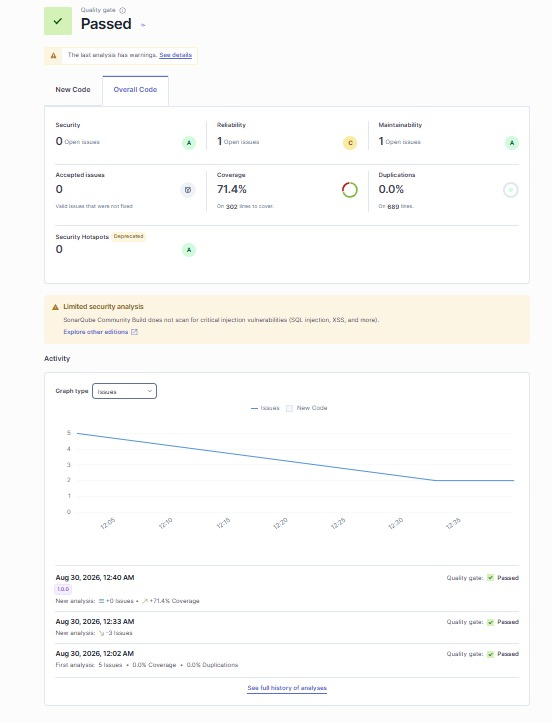
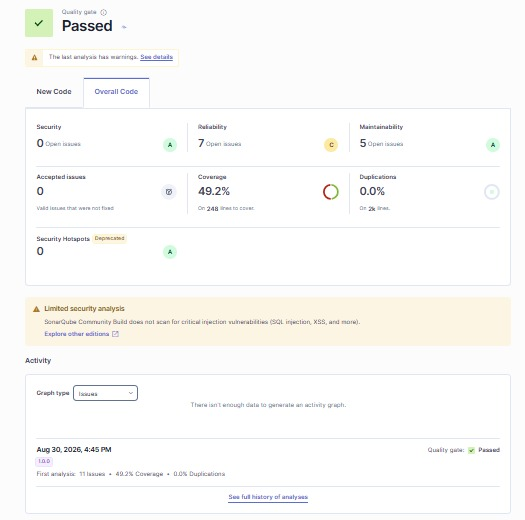
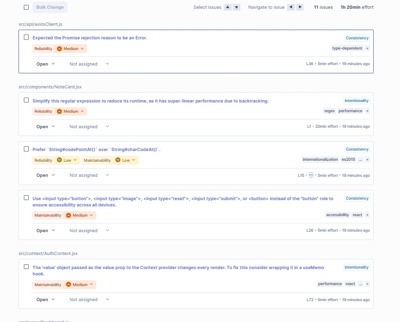

# Notebook — Full-Stack Notes App (MERN-style: React + Node/Express + MySQL)

A production-style Notes application: users sign up, log in, and manage
private, rich-text notes. Built to match the project brief exactly —
Node.js, Express, React, MySQL, Pino logging, JWT auth, global exception
handling, Mocha/Chai (backend) + Jest (frontend) tests, and a SonarQube
config for both halves.

---

## 1. Tech stack

| Layer          | Technology                                                  |
|-----------------|--------------------------------------------------------------|
| Frontend        | React 18 (Vite), React Router, Axios, React-Quill (rich text)|
| Backend         | Node.js, Express                                              |
| Database        | MySQL (via Sequelize ORM)                                     |
| Auth            | JWT (JSON Web Tokens) + bcrypt password hashing                |
| Logging         | Pino + pino-http (structured request/response + app logs)      |
| Testing         | Mocha + Chai + Sinon + Supertest (backend), Jest + React Testing Library (frontend) |
| Code quality    | SonarQube (`sonar-project.properties` in both apps)             |
| Version control | Git                                                            |

---

## 2. File structure

```
notes-app/
├── backend/
│   ├── src/
│   │   ├── config/
│   │   │   ├── database.js        # Sequelize/MySQL connection (SQLite in test mode)
│   │   │   └── logger.js          # Pino logger instance
│   │   ├── models/
│   │   │   ├── user.model.js      # User model (bcrypt hooks, comparePassword)
│   │   │   ├── note.model.js      # Note model (belongs to User)
│   │   │   └── index.js
│   │   ├── middleware/
│   │   │   ├── auth.middleware.js       # JWT "protect" middleware
│   │   │   ├── error.middleware.js      # Global exception handler + 404 handler
│   │   │   └── requestLogger.middleware.js  # Pino HTTP request/response logging
│   │   ├── controllers/
│   │   │   ├── auth.controller.js
│   │   │   └── note.controller.js
│   │   ├── services/               # Business logic / data access (unit-testable)
│   │   │   ├── auth.service.js
│   │   │   └── note.service.js
│   │   ├── routes/
│   │   │   ├── auth.routes.js
│   │   │   ├── note.routes.js
│   │   │   └── index.js
│   │   ├── utils/
│   │   │   ├── ApiError.js         # Custom operational error class
│   │   │   ├── asyncHandler.js     # Wraps async routes -> forwards errors
│   │   │   └── validators.js
│   │   ├── app.js                  # Express app (middleware + routes wired up)
│   │   └── server.js               # Entry point (DB connect, listen, graceful shutdown)
│   ├── tests/
│   │   ├── auth.service.test.js    # Mocha/Chai/Sinon unit tests
│   │   ├── note.service.test.js    # Mocha/Chai/Sinon unit tests
│   │   └── notes.api.test.js       # Supertest integration tests (full HTTP flow)
│   ├── sql/schema.sql              # Raw MySQL DDL (mirrors the Sequelize models)
│   ├── .env.example
│   ├── .mocharc.json
│   ├── sonar-project.properties
│   └── package.json
│
├── frontend/
│   ├── src/
│   │   ├── api/
│   │   │   ├── axiosClient.js      # Axios instance + JWT interceptor
│   │   │   ├── auth.api.js
│   │   │   └── notes.api.js
│   │   ├── context/
│   │   │   └── AuthContext.jsx     # Global auth state (login/register/logout)
│   │   ├── components/
│   │   │   ├── Navbar.jsx
│   │   │   ├── NoteCard.jsx
│   │   │   ├── SearchBar.jsx
│   │   │   ├── PrivateRoute.jsx    # Route guard
│   │   │   └── Loader.jsx
│   │   ├── pages/
│   │   │   ├── Signup.jsx
│   │   │   ├── Login.jsx
│   │   │   ├── Dashboard.jsx       # List of notes + search + create
│   │   │   ├── NoteEditor.jsx      # Rich text editor (create/edit)
│   │   │   └── Profile.jsx         # User details + logout
│   │   ├── styles/                 # global.css / auth.css / dashboard.css / editor.css
│   │   ├── App.jsx                 # Routes
│   │   └── main.jsx                # React entry point
│   ├── tests/
│   │   ├── Login.test.jsx          # Jest + React Testing Library
│   │   ├── Dashboard.test.jsx
│   │   └── setupTests.js
│   ├── index.html
│   ├── vite.config.js
│   ├── jest.config.js
│   ├── babel.config.js
│   ├── sonar-project.properties
│   └── package.json
│
└── README.md   (this file)
```

**Why this structure?** It separates concerns the way a real production app
does: **routes** define URLs, **controllers** parse the request/response,
**services** hold the actual business logic (and are what the unit tests
target), and **models** are the database layer. This makes the app easy to
test, easy to extend, and easy to reason about — exactly what the "clean
architecture" part of your grading rubric is looking for.

---

## 3. Prerequisites

- Node.js 18+ and npm
- MySQL 8+ running locally (or update `.env` to point at any MySQL instance)
- Git

---

## 4. Backend setup

```bash
cd backend
cp .env.example .env      # then edit .env with your real MySQL credentials
npm install
```

Create the database (Sequelize will auto-create the tables on first run in
development mode — but you can also run the SQL manually):

```bash
mysql -u root -p -e "CREATE DATABASE notes_app;"
# optional: mysql -u root -p notes_app < sql/schema.sql
```

Run it:

```bash
npm run dev        # nodemon, auto-restarts on changes
# or
npm start          # plain node
```

The API starts on `http://localhost:5000` (see `PORT` in `.env`).
Health check: `GET http://localhost:5000/api/health`

Run the backend test suite (Mocha/Chai/Sinon + Supertest — uses an
in-memory SQLite DB automatically, so it needs no MySQL setup):

```bash
npm test
```

---

## 5. Frontend setup

```bash
cd frontend
npm install
npm run dev
```

Opens on `http://localhost:5173`. The Vite dev server proxies `/api/*`
requests to `http://localhost:5000` (see `vite.config.js`), so make sure
the backend is running first.

Run the frontend tests (Jest + React Testing Library):

```bash
npm test
```

Build for production:

```bash
npm run build     # outputs to frontend/dist
```

---

## 6. API reference

All responses follow `{ success, message?, data? }`. Protected routes
require `Authorization: Bearer <token>`.

| Method | Route              | Access  | Description                  |
|--------|--------------------|---------|-------------------------------|
| POST   | `/api/auth/register` | Public  | Create an account             |
| POST   | `/api/auth/login`    | Public  | Log in, returns JWT           |
| GET    | `/api/auth/me`       | Private | Current user profile          |
| POST   | `/api/auth/logout`   | Private | Logs out (client discards JWT)|
| GET    | `/api/notes?search=` | Private | List/search your notes        |
| POST   | `/api/notes`         | Private | Create a note                 |
| GET    | `/api/notes/:id`     | Private | Get one note                  |
| PUT    | `/api/notes/:id`     | Private | Update a note                 |
| DELETE | `/api/notes/:id`     | Private | Delete a note                 |

---

## 7. How each requirement from the brief is satisfied

- **Auth & authorization** — JWT issued on register/login, `protect`
  middleware validates it on every private route, passwords hashed with
  bcrypt.
- **Note management + rich text** — `react-quill` editor in
  `NoteEditor.jsx`; content stored as HTML in `notes.content` (MySQL
  `LONGTEXT`).
- **Pino logging** — `config/logger.js` (app-level logs) +
  `middleware/requestLogger.middleware.js` (every HTTP request/response,
  redacting the Authorization header).
- **MySQL** — Sequelize models with `sync()` in dev, plus a hand-written
  `sql/schema.sql` for manual setup or grading review.
- **Global exception handling** — `middleware/error.middleware.js` catches
  everything (including Sequelize validation errors), logs via Pino, and
  returns a clean JSON error to the client; `ApiError` + `asyncHandler`
  keep controllers free of try/catch boilerplate.
- **Unit testing** — `tests/*.test.js` on the backend (Mocha/Chai/Sinon,
  services layer mocked/stubbed + a full Supertest integration run), and
  `tests/*.test.jsx` on the frontend (Jest + RTL).
- **SonarQube** — `sonar-project.properties` in both `backend/` and
  `frontend/`, pointing at `src`, `tests`, and the coverage LCOV reports
  produced by `npm run test:coverage`.
- **Dashboard / Note Editor / Profile screens** — see `frontend/src/pages/`.

---

## 8. Suggested Git workflow

```bash
git init
git checkout -b main
git add .
git commit -m "chore: scaffold full-stack notes app"

git checkout -b feature/notes-crud
# ...work...
git commit -m "feat: add note CRUD endpoints"
git checkout main && git merge feature/notes-crud
```

Use short-lived feature branches per screen/feature (`feature/auth`,
`feature/dashboard`, `feature/rich-text-editor`, etc.) and merge into
`main` via pull requests for a clean, reviewable history.

---

## SonarQube Analysis

SonarQube was used to analyze both the backend and frontend of the Notes App for code quality and maintainability.

### Backend Analysis

The backend project was analyzed using SonarQube. The dashboard provides an overview of the detected code-quality metrics and issues.




### Frontend Analysis

The frontend project was also analyzed using SonarQube. The analysis provides code-quality metrics and detected issues for the frontend codebase.





